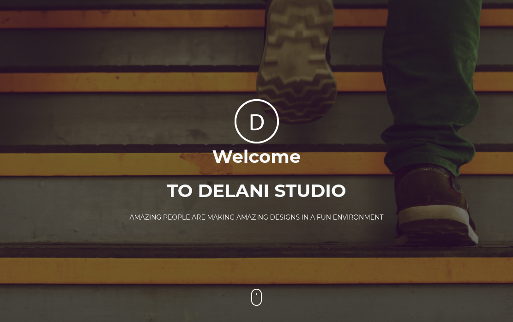
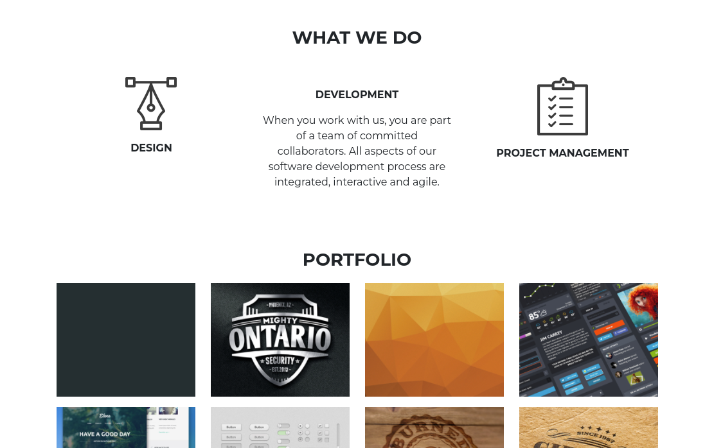
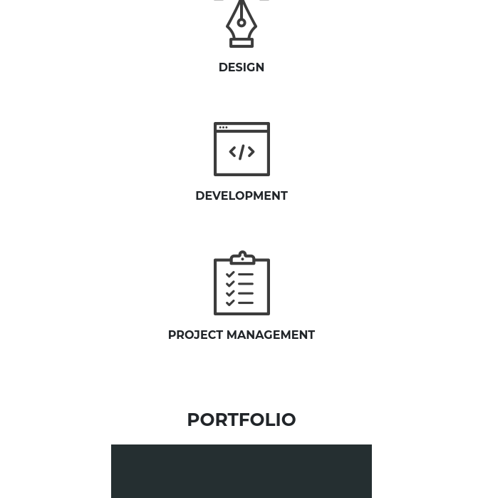

## Delani Studio Project
### Author - [Edu58](https://github.com/Edu58)

### Technologies Used
+ HTML
+ CSS
+ Bootstrap 5
+ Google Fonts
+ jQuery

### Project Description
#### homepage


This project is potrays a design for a fictional studio names Delani. The website is made in HTML, CSS, Bootstrap 5 and Jquery. It is fully mobile responsive and will look appealing on any device no matter the screen size.

Mobile reponsiveness is the main reason for using Bootstrap 5. jQuery is used to introduce interactivity like hover effects, fadingand element toggle effects. Ii is also used to get form data and reset the form after successful submission.



#### On mobile


### Setup and Installation
To get this project up and running, You're going to need a few things:
 1. A computer with internet access
 2. A browser of your choice

####  installation
Clone the repo to your PC/Mac using the link below. Just paste it into yout terminal/CMD.
```
git clone https://github.com/Edu58/Delani-Studio.git
```

OR

You can download a zip file
```
https://github.com/Edu58/Delani-Studio/archive/refs/heads/main.zip
```

once the download is complete, unzip the folder if zipped. Open the folder and locate the index.html. Right click on it and open it with a browser of your choice.

### License info
MIT

for more info, read the [LICENSE](https://github.com/Edu58/Delani-Studio/blob/main/LICENSE) file at the root of this folder.

### Contact
+ [Twitter](https://twitter.com/GISDevEd)
+ [LinkedIn](https://www.linkedin.com/in/edwin-karimi/)
+ [Email](edumuriithi58@gmail.com)